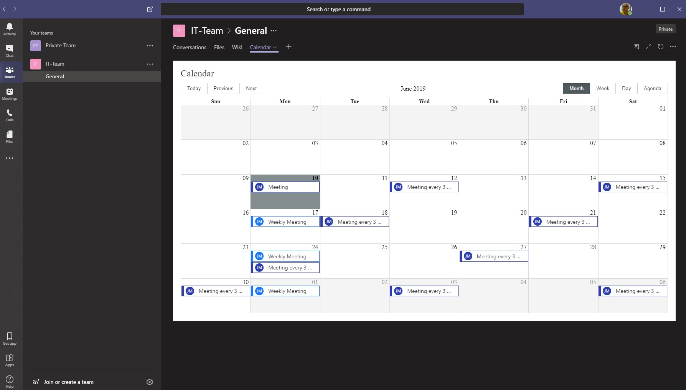
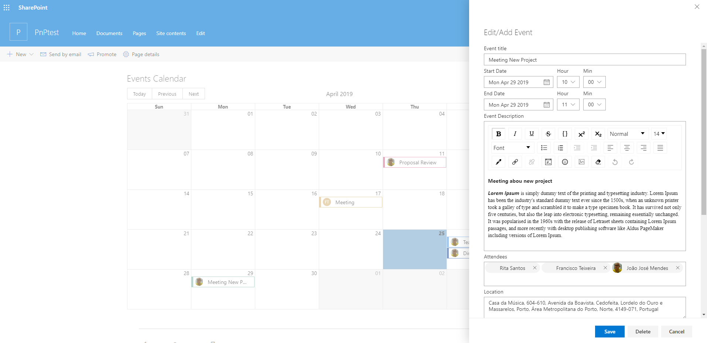

# React Calendar

## Changes made
Functionality was added to allow attachments to be added to events and to deal with display of non-recurring events.

When a new event is created, the initial save will create the event and then the Attachment Control will appear and the Save Button is replaced with a close button.
- This is because the Attachment control from SPFx controls uploads immediately to the item based on ID (so it needs to exist first) - one day I may tackle that control.
- The original calendar webpart would not show anything that was not recurring, changed the control to show the new item view (recurring switch) to enable viewing and ability to change to recurring.

## Summary
This Web Part allows you to manage events in a calendar. 
Uses a list of existing calendars on any website.
The location and name of the list and the dates of the events to be displayed are defined in the properties of the web part.

Each category has its own color that is generated in the load.

The Web Part checks the user's permissions for the View, Add, Edit, and Delete events.

##  
 

##  
 

##  
 

##  
 

 

##  Web Part  - Screenshots

##   
 

 

## Used SharePoint Framework Version 

## Applies to

* [SharePoint Framework](https:/dev.office.com/sharepoint)
* [Office 365 tenant](https://dev.office.com/sharepoint/docs/spfx/set-up-your-development-environment)

## WebPart Properties
 
Property |Type|Required| comments
--------------------|----|--------|----------
Site Url of Calendar List | Text| yes|
Calendar list| Choice/Dropdown | yes|  this is filled with all list of  type "event list" created
Start Date | Date | yes | Event Date 
End Date| Date| yes | Event Date
 

## Solution
The Web Part Use PnPjs library, Office-ui-fabric-react components. react Big-Calendar Compoment

Solution|Author(s)
--------|---------
Calendar  Web Part|João Mendes

## Version history

Version|Date|Comments
-------|----|--------
1.0.0|April 25, 2019|Initial release
1.0.1|June 10, 2019|update add recurrence events

## Disclaimer
**THIS CODE IS PROVIDED *AS IS* WITHOUT WARRANTY OF ANY KIND, EITHER EXPRESS OR IMPLIED, INCLUDING ANY IMPLIED WARRANTIES OF FITNESS FOR A PARTICULAR PURPOSE, MERCHANTABILITY, OR NON-INFRINGEMENT.**

---

## Minimal Path to Awesome

- Clone this repository
- in the command line run:
  - `npm install`
  - `gulp build`
  - `gulp bundle --ship`
  - `gulp package-solution --ship`
  - `Add to AppCatalog and deploy`

